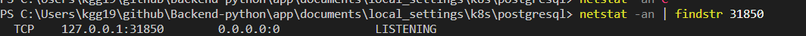

# 개요
* randcher desktop에서 postgresql 설치 가이드

# 설치
* namespace 생성
```shell
kubectl create ns infra
```

* 쿠버네티스 리소스 배포
```shell
kubectl apply -f .
```

# 설치확인
```shell
kubectl -n infra get po,deploy,svc,pvc
```

